# laravel Persian UI Template


<h2 dir="rtl">  بسته پارسی UI برای لاراول </h2>

<p dir="rtl">
یکی از مشکلات استفاده از کامپوننت‌های Vuejs یا ReactJs این است که روش استفاده آن در فایل blade آسان نمی‌باشد، و مستلزم زحمت و تجربه بالاست، با استفاده از این بسته به سادگی از کامپوننت های ui با بالاترین کیفیت ux در لاراول به نتیجه دلخواه خود برسید
با کمترین وابستگی (تنها وابستگی های این پروژه فونت‌ها می‌باشند)
</p>
<h2 dir="rtl">
معرفی کامپوننت های توسعه یاته تا کنون
</h2>


<h3 dir="rtl">
تقویم شمسی با قابلیت نمایش محتوا در روز مورد نظر
</h3>


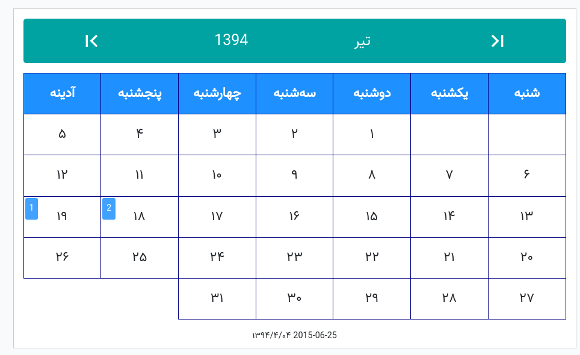

<h3 dir="rtl">
فیلد اعتباری مناسب برای استفاده قیمت
</h3>

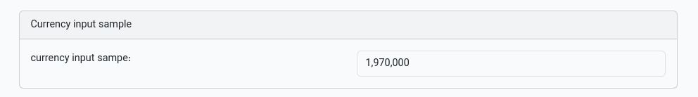

<h3 dir="rtl">
انتخاب گر آیکون remix 
</h3>

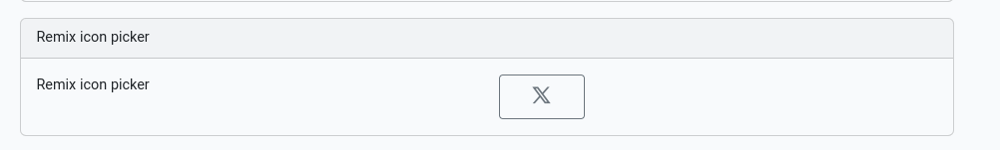
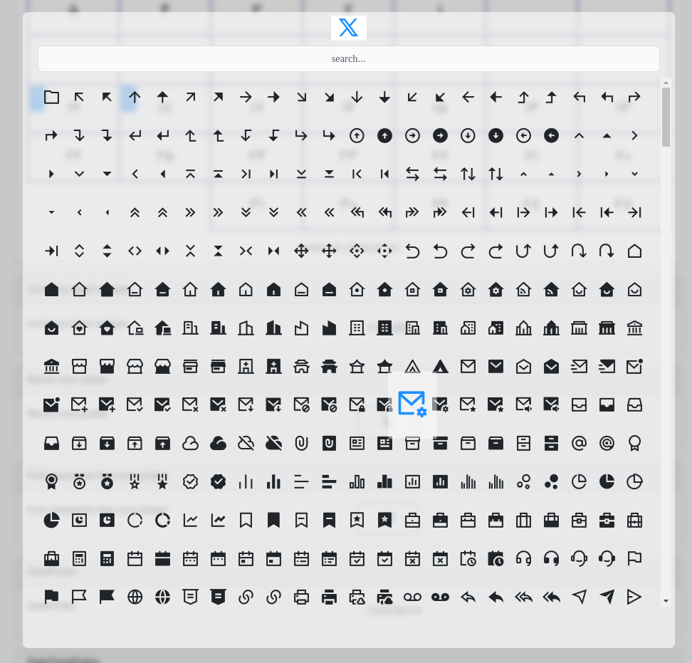

<h3 dir="rtl">
انتخاب‌گر آیکون font awesome 
</h3>

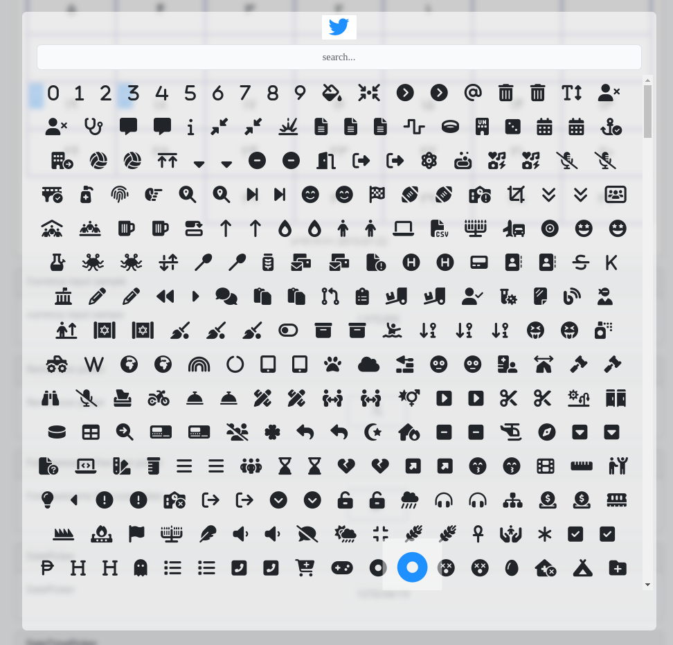

<h3 dir="rtl">
date picker شمسی و میلادی
</h3>

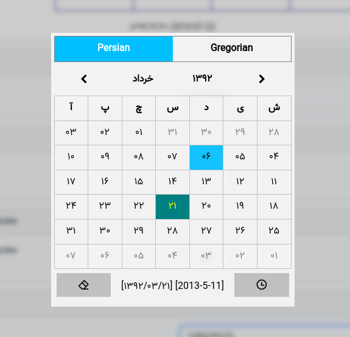

<h3 dir="rtl">
date time picker شمسی و میلادی
</h3>

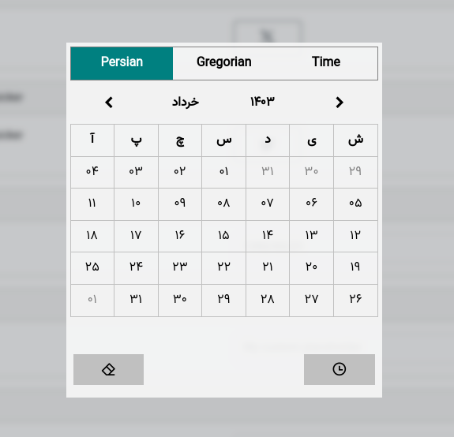
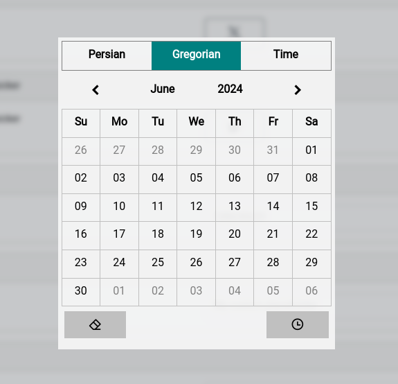


<h3 dir="rtl">
date range picker شمسی و میلادی
</h3>

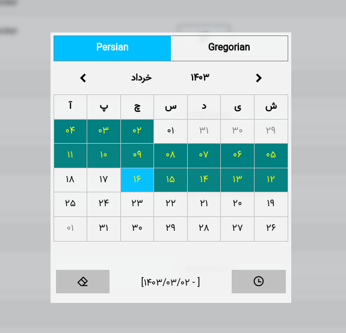


<h3 dir="rtl">
ورودی select با قابلیت جستجو
</h3>

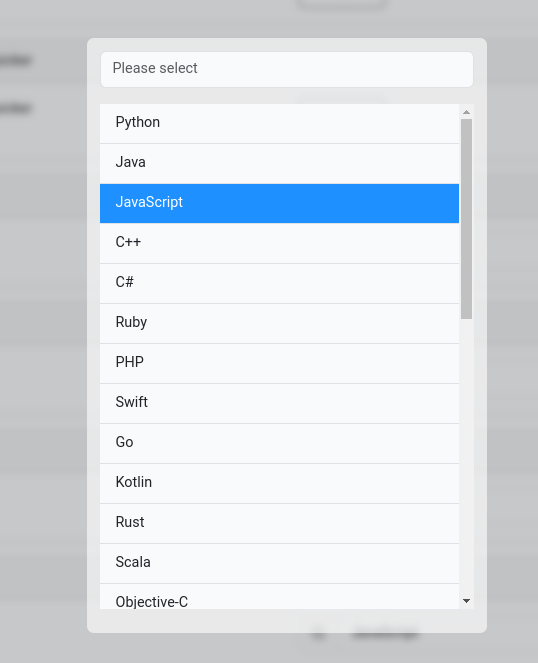

<h3 dir="rtl">
انتخاب گر چندگانه با قابلیت جستجو
</h3>

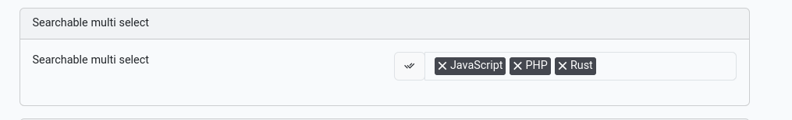
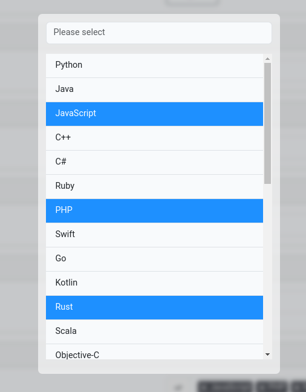

<h3 dir="rtl">
افزیانده و کاهنده 
</h3>

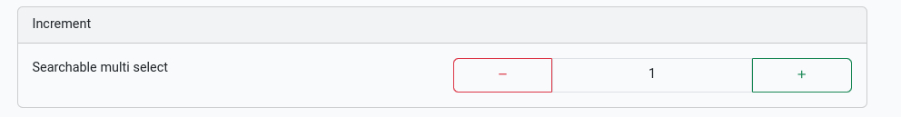

<h3 dir="rtl">
 ورودی برچسب ها یا تگ
</h3>


<h3 dir="rtl">
 نحوه به ترتیب ذکر شده در blade
</h3>


```php
<vue-jalali-calendar
    :year="1394" {{-- year --}}
    :month="4" {{-- month --}}
    {{--        onSelect=""--}} {{-- your event o select --}}
    :texts='{"2015-07-10":"1","2015-07-09":"2","2015-08-10":"2"}' {{-- custom text each days --}}
></vue-jalali-calendar>
<div class="card mt-3">
    <div class="card-header">
        Currency input sample
    </div>
    <div class="card-body">
        <div class="row">
            <div class="col-md-6">
                currency input sampe:
            </div>
            <div class="col-md-6">
                <currency-input xid="test" xname="test" xtitle="Currency input sample" xvalue="10000"></currency-input>
            </div>
        </div>
    </div>
</div>
<div class="card mt-3">
    <div class="card-header">
        Remix icon picker
    </div>
    <div class="card-body">
        <div class="row">
            <div class="col-md-6">
                Remix icon picker
            </div>
            <div class="col-md-6">
                <remix-icon-picker xname="icon" xvalue="ri-twitter-x-line"></remix-icon-picker>
            </div>
        </div>
    </div>
</div>
<div class="card mt-3">
    <div class="card-header">
        Font awesome free icon picker
    </div>
    <div class="card-body">
        <div class="row">
            <div class="col-md-6">
                Font awesome free icon picker
            </div>
            <div class="col-md-6">
                <awesome-icon-picker xname="icon" xvalue="fab fa-twitter"></awesome-icon-picker>
            </div>
        </div>
    </div>
</div>
<div class="card mt-3">
    <div class="card-header">
        DatePicker
    </div>
    <div class="card-body">
        <div class="row">
            <div class="col-md-6">
                DatePicker
            </div>
            <div class="col-md-6">
                <vue-datetime-picker-input xname="datepicker" xtitle="DOB" :xvalue="679097914" :close-on-Select="true"></vue-datetime-picker-input>
            </div>
        </div>
    </div>
</div>
<div class="card mt-3">
    <div class="card-header">
        DateTimePicker
    </div>
    <div class="card-body">
        <div class="row">
            <div class="col-md-6">
                DateTimePicker
            </div>
            <div class="col-md-6">
                <vue-datetime-picker-input xname="datepicker" xtitle="My custom placeholder"  :xvalue="" :timepicker="true" xshow="hpdatetime"></vue-datetime-picker-input>
            </div>
        </div>
    </div>
</div>
<div class="card mt-3">
    <div class="card-header">
        Date Range Picker
    </div>
    <div class="card-body">
        <div class="row">
            <div class="col-md-6">
                Date Range Picker
            </div>
            <div class="col-md-6">
                <vue-date-range-picker-input xname="datepicker" xtitle="Trip range" :close-on-Select="false" :xvalue="" :timepicker="true" xshow="hpdatetime"></vue-date-range-picker-input>
            </div>
        </div>
    </div>
</div>
<div class="card mt-3">
    <div class="card-header">
        Searchable select
    </div>
    <div class="card-body">
        <div class="row">
            <div class="col-md-6">
                Searchable select
            </div>
            <div class="col-md-6">
                <searchable-select :items='{{\App\Models\Category::all(['id','title'])}}' title-field="title" xvalue="3" :close-on-Select="true"></searchable-select>
            </div>
        </div>
    </div>
</div>
<div class="card mt-3">
    <div class="card-header">
        Searchable multi select
    </div>
    <div class="card-body">
        <div class="row">
            <div class="col-md-6">
                Searchable multi select
            </div>
            <div class="col-md-6">
                <searchable-multi-select :items='{{\App\Models\Category::all(['id','title'])}}' title-field="title" :xvalue='[3,11,7]' :close-on-Select="true"></searchable-multi-select>
            </div>
        </div>
    </div>
</div>
<div class="card mt-3">
    <div class="card-header">
        Increment
    </div>
    <div class="card-body">
        <div class="row">
            <div class="col-md-6">
                Searchable multi select
            </div>
            <div class="col-md-6">
                <increment :xvalue="1"></increment>
            </div>
        </div>
    </div>
</div>
<div class="card mt-3">
    <div class="card-header">
        Tag input
    </div>
    <div class="card-body">
        <div class="row">
            <div class="col-md-6">
                Searchable multi select
            </div>
            <div class="col-md-6">
                <tag-input :xvalue=""></tag-input>
            </div>
        </div>
    </div>
</div>
```
<h3 dir="rtl">
 نحوه به ترتیب ذکر شده در vuejs به صورت مستقیم
</h3>

```vue
<template>
    <div id="example">
        <div class="p-2">
            <currency-input v-model="p"></currency-input>
            <span>
                {{ p }}
            </span>
        </div>
        <div class="p-2">
            <font-awesome-icon-picker v-model="f"></font-awesome-icon-picker>
            <span>
                {{ f }}
            </span>
        </div>
        <div class="p-2">
            <remix-icon-picker v-model="r"></remix-icon-picker>
            <span>
                {{ r }}
            </span>
        </div>

        <div class="p-2">
            <searchable-multi-select :items="cats" v-model="mss"></searchable-multi-select>
            <span>
                {{ mss }}
            </span>
        </div>
        <div class="p-2">
            <vue-date-range-picker  v-model="dpr"></vue-date-range-picker>
            <span>
                {{ dpr }}
            </span>
        </div>
        <div class="p-2">
            <vue-date-time-picker v-model="dp"></vue-date-time-picker>
            <span>
                {{ dp }}
            </span>
        </div>
        <div class="p-2">
            <vue-date-time-picker v-model="dpt" :timepicker="true"></vue-date-time-picker>
            <span>
                {{ dpt }}
            </span>
        </div>
        <div class="p-2">
           <increment v-model="i"></increment>
            <span>
                {{ i }}
            </span>
        </div>
        <div class="p-2">
           <tag-input v-model="tags"></tag-input>
            <span>
                {{ tags }}
            </span>
        </div>

    </div>
</template>

<script>
import CurrencyInput from "./CurrencyInput.vue";
import fontAwesomeIconPicker from "./FontAwesomeIconPicker.vue";
import remixIconPicker from "./RemixIconPicker.vue";
import searchableSelect from "./SearchableSelect.vue";
import searchableMultiSelect from "./searchableMultiSelect.vue";
import vueDateTimePicker from "./vueDateTimePicker.vue";
import vueDateRangePicker from "./vueDateRangePicker.vue";
import Increment from "./Increment.vue";
import TagInput from "./TagInput.vue";
export default {
    name: "example",
    components: {
        CurrencyInput, fontAwesomeIconPicker, remixIconPicker,Increment,TagInput,
        searchableSelect, searchableMultiSelect, vueDateRangePicker, vueDateTimePicker
    },
    data: () => {
        return {
            p: 100000,
            f: 'fa fa-user',
            r: 'ri-user-line',
            ss: 3,
            mss: [3,11,7],
            dpr:[],
            dp: null,
            dpt: null,
            i:7,
            tags:'hello,world'
        }
    },
    props: {
        cats: {
            default: [],
        }
    },
    mounted() {
    },
    computed: {},
    methods: {}
}
</script>

<style scoped>
#example {

}
</style>

```

## how test it

- Rename `.env.exampe` to `.env`
- Setup you database
- Migrate and seed database
```bash
php artisan migrate:fresh --seed
```
- Run project as dev:
```bash
npm run dev
php artsian serv
```

<div style="text-align: center">
     Developed With Love ! ❤️
</div>
